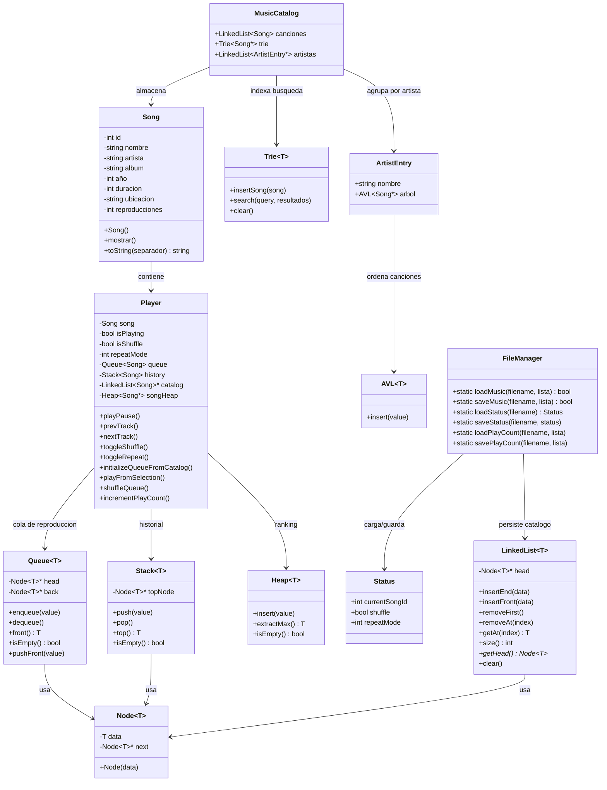

# MIRAI-PLAYER 2

> Reproductor de música por consola desarrollado en C++ con estructuras de datos personalizadas.

---

## Integrantes

- Ramiro Alvarado Durán
- Patricio Alvarado Durán
- Alonso Jorquera

---

## Descripción

MIRAI-PLAYER 2 es un reproductor musical por consola en C++ que extiende el desarrollo del Taller 1.
Implementa de forma manual listas enlazadas, pilas, colas, Trie, Heap y AVL.
Permite reproducir, pausar y gestionar una cola con shuffle, repetición e historial de pistas.
Agrega búsqueda de canciones por nombre y/o artista, ranking TOP 10 y gestión del catálogo musical.
El catálogo se carga desde `music_source.txt`; al salir se guarda la sesión en `status.cfg`.
Los contadores de reproducción persisten en `song_ranking.txt`; las estructuras de árbol se reconstruyen al iniciar.
Trie indexa la búsqueda, Heap ordena el ranking y AVL mantiene las canciones por artista en orden alfabético.

---

## Diagrama de Clases



---

## Instrucciones de compilación y ejecución

### Requisitos

- Compilador compatible con **C++14** o superior (GCC, MinGW, Cygwin)
- Terminal de consola (Windows CMD, PowerShell o terminal Unix)

### Compilar

Desde la carpeta `miraiPlayer/`:

```bash
g++ -std=c++14 -o miraiPlayer.exe main.cpp clases/Song.cpp clases/Player.cpp nucleo/SongMenu.cpp nucleo/SearchMenu.cpp nucleo/PlaylistMenu.cpp nucleo/TopMenu.cpp nucleo/MusicCatalog.cpp
```

### Ejecutar

Desde la misma carpeta `miraiPlayer/` (para que encuentre los archivos de datos):

```bash
./miraiPlayer.exe
```

En Windows CMD o PowerShell:

```powershell
.\miraiPlayer.exe
```

---

## Funcionamiento

Al iniciar, el programa carga el catálogo desde `music_source.txt`, restaura los contadores desde `song_ranking.txt`, reconstruye las estructuras Trie, Heap y AVL, y recupera la sesión desde `status.cfg`. Al salir con **X**, guarda el estado y los contadores de reproducción.

### Menú principal

| Tecla | Acción |
|---|---|
| W | Reproducir / Pausar |
| Q | Pista anterior |
| E | Pista siguiente |
| S | Activar / Desactivar modo aleatorio |
| R | Repetición (Desactivado / Repetir una / Repetir todas) |
| A | Ver lista de reproducción actual |
| L | Listado de canciones |
| F | Buscar canciones |
| T | TOP 10 Artistas y Canciones |
| X | Salir |

### Búsqueda de canciones (F)

Se ingresa un texto y la búsqueda se ejecuta al confirmar con Enter. Si el texto está vacío, vuelve al menú principal. Si no, muestra todas las canciones cuyo **nombre** o **artista** contengan el texto ingresado. La búsqueda se actualiza al agregar o eliminar canciones.

| Tecla | Acción |
|---|---|
| R\<num\> | Reproduce la canción seleccionada, vacía la cola y carga el resto de la biblioteca en orden aleatorio |
| A\<num\> | Agrega la canción al final de la cola sin alterar la pista actual |
| F | Repetir búsqueda con otro texto |
| V | Volver al menú principal |

### Ranking TOP (T)

Muestra el TOP 10 de canciones y artistas más escuchados según el contador de reproducciones. Si hay menos de 10 registros, muestra TOP *n*. En empates, las canciones se ordenan alfabéticamente por nombre y luego por artista; los artistas se ordenan alfabéticamente.

**Menú inicial del ranking:**

| Tecla | Acción |
|---|---|
| C | Top 10 canciones más escuchadas |
| A | Top 10 artistas más escuchados |
| X | Volver al menú principal |

**Top de canciones:**

| Tecla | Acción |
|---|---|
| R\<num\> | Reproduce la canción, vacía la cola y mezcla el resto de la biblioteca |
| A\<num\> | Agrega la canción al final de la cola |
| A | Ir al TOP 10 de artistas |
| V | Volver al menú principal |

**Top de artistas:**

| Tecla | Acción |
|---|---|
| S\<num\> | Mostrar canciones del artista (orden alfabético) |
| C | Ir al TOP 10 de canciones |
| V | Volver al menú principal |

**Canciones por artista:**

| Tecla | Acción |
|---|---|
| R\<num\> | Reproduce la canción, vacía la cola y mezcla el resto de la biblioteca |
| A\<num\> | Agrega la canción al final de la cola |
| V | Volver al TOP 10 de artistas |
| X | Volver al menú principal |

### Listado de canciones (L)

| Tecla | Acción |
|---|---|
| R\<num\> | Reproducir canción |
| A\<num\> | Agregar canción a la cola |
| N | Registrar nueva canción |
| D\<num\> | Eliminar canción |
| V | Volver al menú principal |

### Lista de reproducción (A)

| Tecla | Acción |
|---|---|
| S\<num\> | Saltar a la canción indicada |
| V | Volver al menú principal |

### Archivos de datos

| Archivo | Descripción |
|---|---|
| `music_source.txt` | Catálogo de canciones (CSV: id, nombre, artista, álbum, año, duración, ubicación) |
| `status.cfg` | Estado de la sesión (canción actual, shuffle, modo repetición) |
| `song_ranking.txt` | Contador de reproducciones por canción (id, reproducciones) |

---

## Estructura del Proyecto

```
EDD-ReproductorMusica2/
├── README.md
├── .gitignore
└── miraiPlayer/
    ├── main.cpp
    ├── music_source.txt
    ├── status.cfg
    ├── song_ranking.txt
    ├── clases/
    │   ├── Player.hpp / Player.cpp
    │   └── Song.hpp / Song.cpp
    ├── estructuras/
    │   ├── AVL.hpp
    │   ├── Heap.hpp
    │   ├── LinkedList.hpp
    │   ├── Node.hpp
    │   ├── Queue.hpp
    │   ├── Stack.hpp
    │   ├── Status.hpp
    │   ├── Trie.hpp
    │   └── Utils.hpp
    └── nucleo/
        ├── FileManager.hpp
        ├── MusicCatalog.hpp / MusicCatalog.cpp
        ├── PlaylistMenu.hpp / PlaylistMenu.cpp
        ├── SearchMenu.hpp / SearchMenu.cpp
        ├── SongMenu.hpp / SongMenu.cpp
        └── TopMenu.hpp / TopMenu.cpp
```

---

*Taller 2 – Estructuras de Datos, Primer Semestre 2026 | Universidad Católica del Norte*
