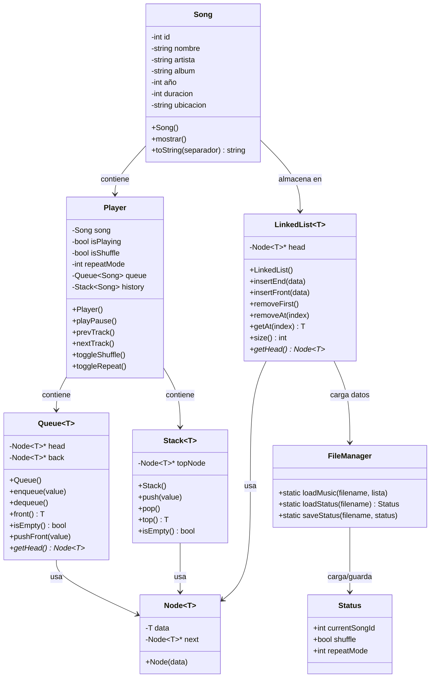

# MIRAI-PLAYER 2

> Reproductor de música por consola desarrollado en C++ con estructuras de datos personalizadas.

---

## Integrantes

Ramiro Alvarado Durán ||
Patricio Alvarado Durán

---

## Descripción

MIRAI-PLAYER es un reproductor de música por consola desarrollado en C++.
Simula la reproducción y gestión de canciones desde un archivo local, implementando estructuras de datos como linked lists, pilas y colas. Incluye reproducción/pausa, shuffle, repetición y gestión de listas de reproducción. Las canciones se cargan desde el archivo music_source.txt, mientras que el estado de la sesión se guarda en status.cfg para retomar la reproducción al abrir el programa.

---

## Diagrama de Clases



---

### Requisitos
- Compilador compatible con C++14 o superior (GCC, MinGW, Cygwin)

---

## Instrucciones de compilación y ejecución

### Windows con MinGW, GCC o Cygwin


### Controles

| Tecla | Acción |
|---|---|
| W | Reproducir / Pausar |
| Q | Pista anterior |
| E | Pista siguiente |
| S | Activar / Desactivar modo shuffle |
| R | Repetición (Desactivado / Repetir una / Repetir todas) |
| A | Ver lista de reproducción actual |
| L | Listado de canciones |
| X | Salir |

---

## Estructura del Proyecto

```
├── miraiPlayer/
│   ├── clases/
│   │   ├── Player.hpp / .cpp
│   │   ├── Playlist.hpp
│   │   └── Song.hpp / .cpp
│   ├── estructuras/
│   │   ├── LinkedList.hpp
│   │   ├── Node.hpp
│   │   ├── Queue.hpp
│   │   ├── Stack.hpp
│   │   └── Status.hpp
│   └── nucleo/
│       ├── FileManager.hpp
│       └── SongMenu.cpp
├── main.cpp
├── README.md
└── .gitignore
```

---

*Taller 2 – Estructuras de Datos, Primer Semestre 2026 | Universidad Católica del Norte*
